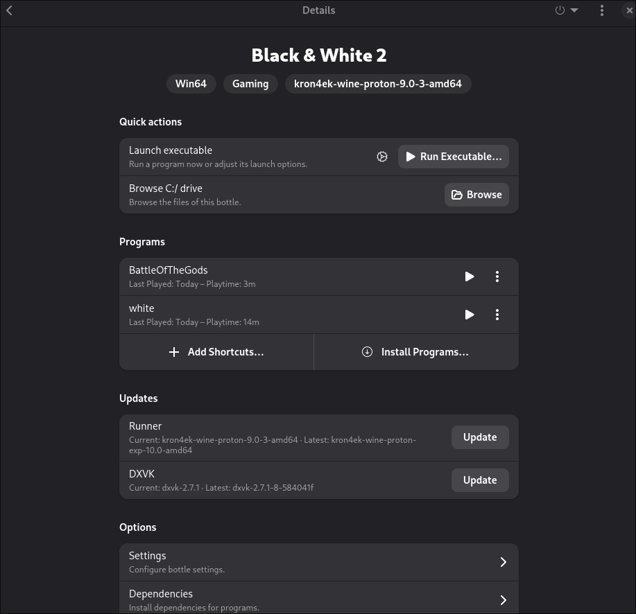

# Black & White 2 on Linux

The process is very similar to the Black & White 1 guide, so I will keep this simple and short. For more details, you can inspect the exported bottles file.

## Requirements

### Game

- Black & White 2
- Black & White 2: Battle of the Gods

### Patches

- [BW2 V1.1 Patch](https://www.bwgame.net/downloads/bw2-v1-1-patch.587/)
- [BW2 V1.2 Patch](https://www.bwgame.net/downloads/bw2-v1-2-patch.695/)
- [Black & White 2 Unofficial Patch v1.42](https://www.bwgame.net/downloads/black-white-2-unofficial-patch-v1-42.1421/)
- [BW2 BotG V1.1 Fan Patch](https://www.bwgame.net/downloads/bw2-botg-v1-1-fan-patch.1422/)

## Setup

### Bottles

Create a new Bottle with the following properties:

- **Name:** `Black & White 2`
- **Type:** Gaming
- **Runner:** `kron4ek-wine-proton-9`

#### Settings

- Disable `VKD3D`
- **Windows Version:** `Windows 10`

##### DLL Overrides

- `blinkw32` -> `Native, then Builtin`

##### Manage Drives

- Add your installation CD-ROM/ISO mount folders.
- Add the folder containing your downloaded patches.

> You can safely remove these drives after the installation is complete.

## Install Game

Open Wine Explorer (**Tools -> Legacy Wine Tools -> Explorer**).

1. Install the base game from the mounted CD by running `Setup.exe`.
    - Choose "Register Later" to skip online registration.
    - Close the ReadMe file.
    - Do **not** start the game yet.
2. Install the patches **in the following exact order**:
    - BW2 V1.1 Patch
    - BW2 V1.2 Patch
    - Black & White 2 Unofficial Patch v1.42
3. Test if the game launches by double-clicking `white.exe` inside Wine Explorer.
    - Go to Options and configure your video resolution.
    - Quit the game 🎉

### Install Battle of the Gods

Still inside Wine Explorer, navigate to your Battle of the Gods CD folder.

1. Install the expansion by running `Setup.exe`.
2. Install the fan patch:
    - BW2BOTGFanPatchInstaller
3. Test if the expansion launches by double-clicking `BattleOfTheGods.exe` inside Wine Explorer.
    - Configure video resolutions inside the Options menu if needed.
    - Quit the game.

> If the game fails to launch from Explorer, you may need to find a no-CD executable and place it into the game directory.

## Add Shortcuts

If everything runs correctly from Wine Explorer, you can now add shortcuts to your **Programs** tab in Bottles:

- `white`
- `BattleOfTheGods`

### Check Launcher Options

Ensure your individual shortcut settings are configured as follows:

- `DXVK` -> Enabled
- `VKD3D` -> Disabled
- `Gamescope` -> Disabled
- `Virtual Desktop` -> Disabled

If a shortcut fails to launch the game, open its options and set the **Working Directory** manually to your game folder (e.g., `.../drive_c/Program Files (x86)/Lionhead Studios Ltd/Black & White 2/`).

---

## Links

- https://lutris.net/games/black-white-2/
- https://www.bwgame.net/downloads/categories/black-white-2.2/
- https://www.reddit.com/r/blackandwhite2/comments/1ivv3n1/black_white_2_plus/
- https://appdb.winehq.org/objectManager.php?sClass=version&iId=39939