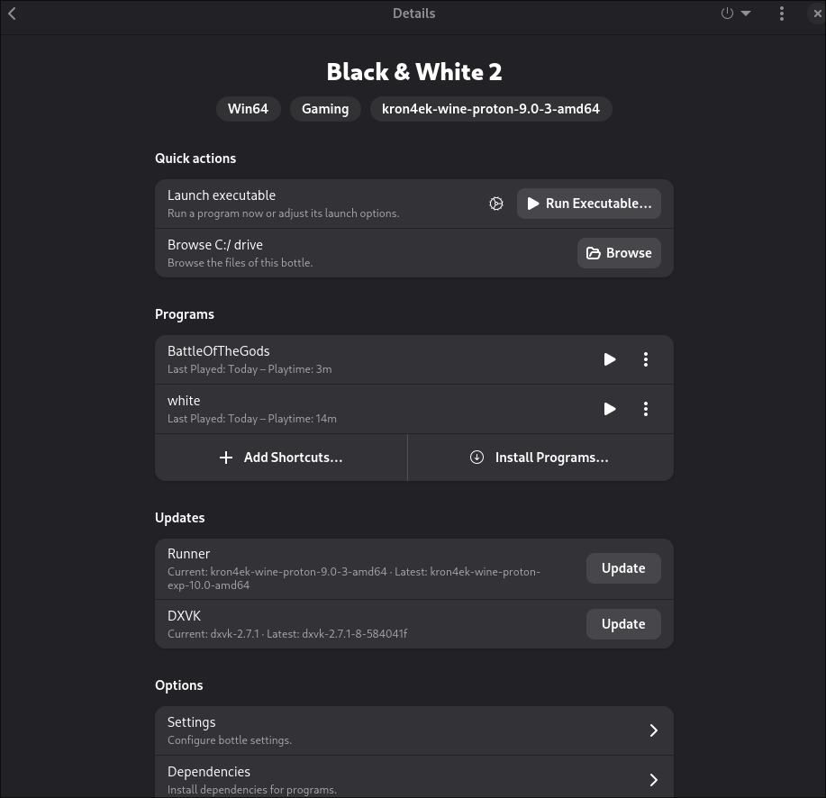

# Black & White 2 on Linux

Process is the same as in the Black & White 1 guide, I just keep it simple and short.
For more details see exported bottles file.

## Requirements

### Game

- Black & White 2
- Black & White 2 Battle of the Gods

### Patches

- [BW2 V1.1 Patch](https://www.bwgame.net/downloads/bw2-v1-1-patch.587/)
- [BW2 V1.2 Patch](https://www.bwgame.net/downloads/bw2-v1-2-patch.695/)
- [Black & White 2 Unofficial Patch v1.42](https://www.bwgame.net/downloads/black-white-2-unofficial-patch-v1-42.1421/)

- [BW2 BotG V1.1 Fan Patch](https://www.bwgame.net/downloads/bw2-botg-v1-1-fan-patch.1422/)

## Setup

### Bottles

Create a new Bottle with the following properties:

- **Name:** `Black & White 2`
- **Gaming**
- **Runner:** `kron4ek-wine-proton-9`

#### Settings

- Disable `VK3D3D`
- **Windows Version:** `Windows 10`

##### DLL Overrides

- `blinkw32`    Native, then Buildin

##### Manage Drives

- add install CD-ROMs folders
- add folder to downloaded patches

> you can remove them later

## Install Game

Start the Explorer (Tools -> Legacy Wine Tools -> Explorer).

1. Install Game from mounted CD, run `Setup.exe`
    - don't register ("Register Later")
    - close ReadMe
    - don't start game
2. Install Patches in the following order:
    - BW2 V1.1 Patch
    - BW2 V1.2 Patch
    - Black & White 2 Unofficial Patch v1.42
3. Test if the Game starts, double-click on `white.exe` in the Explorer
    - Go to Options and setup Video resolution etc. if needed
    - Quit Game 🎉

### Install Battle of the Gods

Still in Explorer, go to BattleOfTheGods CD.

1. Install the Add-On, run the `Setup.exe`
2. Install Patches:
    - BW2BOTGFanPatchInstaller
3. Test if the Game starts, double-click on `BattleOfTheGods.exe` in the Explorer
    - Go to Options and setup Video resolution etc. if needed
    - Quit Game

> If the game didn't start from the Explorer, try to find a no-cd exe and put it into the game directory

## Add Shortcuts

If everything starts and runs, from the Explorer, it's time to add Shortcuts in Programs.

- white
- BattleOfTheGods

### Check for Launch Options

- `DXVK` enabled
- `VKD3D` disabled
- `Gamescope` idsabled
- `Virtual Desktop` disabled

If the game didn't start from the Shortcut, try to set "Working Directory" to the game directory (`.../drive_c/Program Files (x86)/Lionhead Studios/Black & White 2/`).

---

## Links

- https://lutris.net/games/black-white-2/
- https://www.bwgame.net/downloads/categories/black-white-2.2/
- https://www.reddit.com/r/blackandwhite2/comments/1ivv3n1/black_white_2_plus/
- https://appdb.winehq.org/objectManager.php?sClass=version&iId=39939