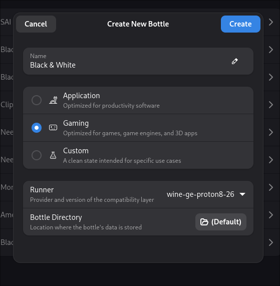
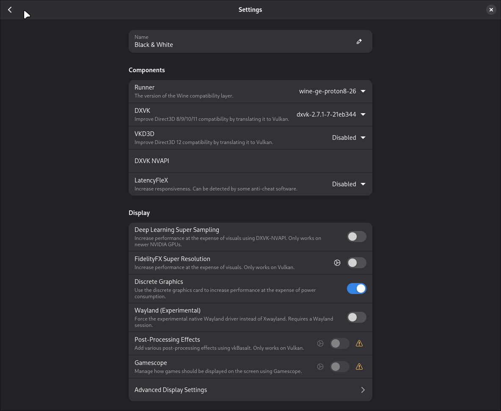
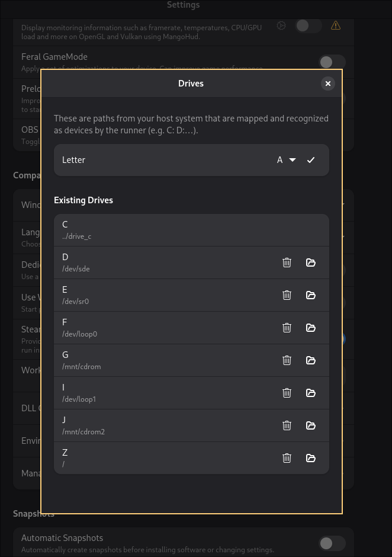
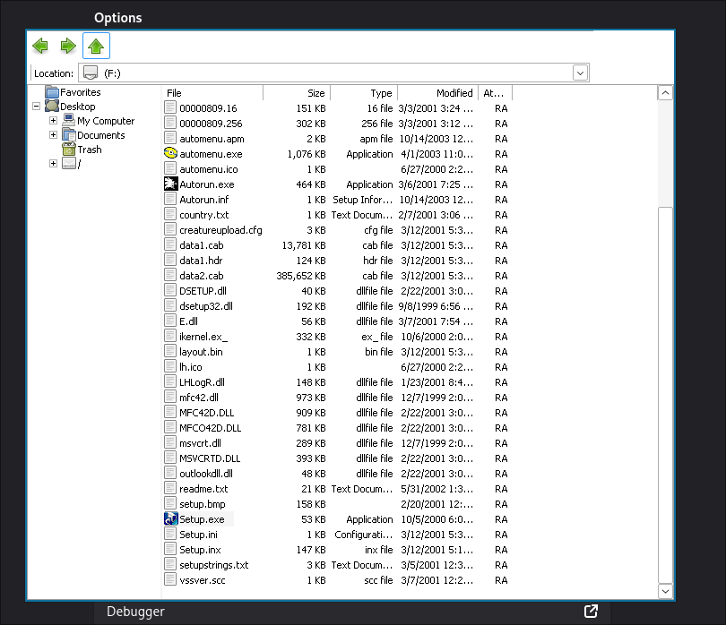
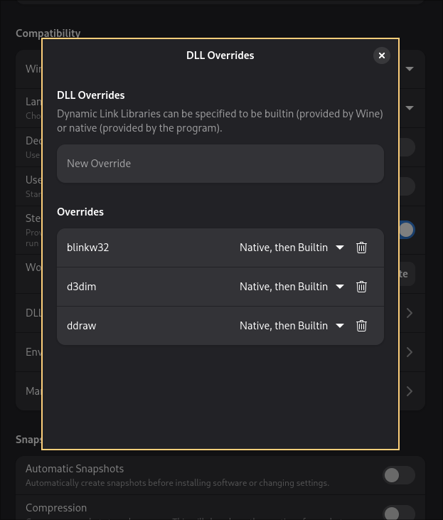
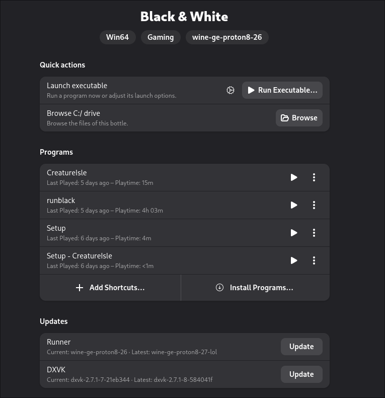
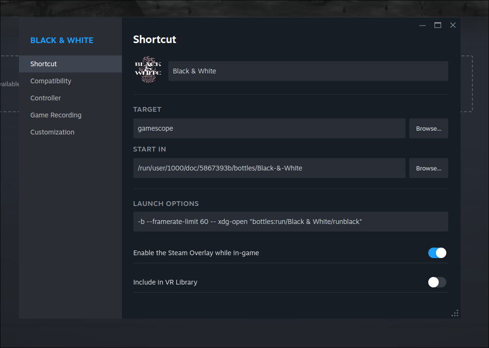
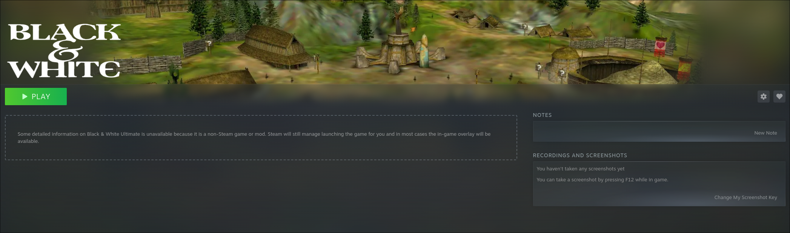
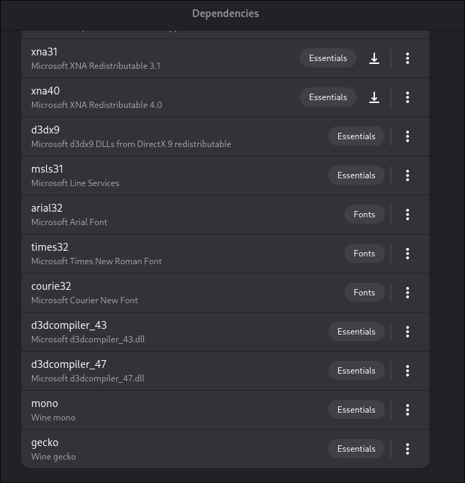

# Black & White on Linux

This guide explains how to install **Black & White (2001)** on Linux using **Wine via Bottles** 🍷.

## Requirements

### System

You need [bottles](https://usebottles.com/), simples way to install bottles is through [flatpak](https://flathub.org/en/apps/com.usebottles.bottles).

### Game

Black & White is considered **abandonware**. You can usually find it online, or you can use CDs/backups you already own.

- Black & White (2001)
- Black & White: Creature Idle (2002)

#### Patches

- [Villager Banter](https://www.bwgame.net/downloads/villager-banter.139/)
- [Football Addon](https://www.bwgame.net/downloads/football-addon.138/)
- [Patch v1.1](https://forum.bwgame.net/downloads/v1-1-patch.129/)
- [Patch v1.2](https://www.bwgame.net/downloads/v1-2-patch.130/)
- [Patch v1.42 (Fanpatch)](https://www.bwgame.net/downloads/black-white-unofficial-patch-v1-42.1418/)

## Installation (through bottles and wine)

### preparation

1. Download all patches and store them in a folder (e.g. `~/Downloads/patches`).
2. Mount the CDs or ISO files:
   - Black & White -> `/mnt/cdrom`
   - Creature Isle -> `/mnt/cdrom2`

### Setup bottle

1. Open **Bottles** and click **"+"** to create a new bottle.

- **Name:** `Black & White`
- **Type:** Gaming
- **Runner:** `wine-ge-proton8-26`

> You can install additional runners in Bottles via  
> **Main Menu -> Preferences → Runners -> Wine GE**, then download `wine-ge-proton8-26`

2. Open the bottle **Settings**:

- Disable `VKD3D`
- **set "Windows Version" to `Windows XP`**

3. Open **Manage Drives** and add your CD-ROM mount points: `/mnt/cdrom` and `/mnt/cdrom2`

> You can also add the folder containing the patches here.  
> CD- and patches-drives can be removed after installation.

### Install Game

1. Open the **Black & White** bottle.
2. Go to **Tools -> Legacy Wine Tools -> Explorer**.
3. Navigate to the mounted CD and run `Setup.exe`.

> **Note:** A serial key is required. It can usually be found online due to the game being abandonware.

Use default settings during installation.  
Skip the ReadMe, do **not** start the game, and skip online registration.

#### Copy audio files

Copy "Audio" directory from CD into installed game directory `C:\Program Files (x86)\Lionhead Studios Ltd\Black & White`.

### Install patches

Still in Wine Explorer, navigate to your patches folder  
(e.g. `Z:\home\user\Downloads\patches`) and install the patches **in this order**:

1. Black_White_Patch_v1.100.exe
2. BW_Football_Addon.exe
3. BW_Villager_Banter.exe
4. black_white_patch_v1_20.exe
5. BWFanPatchInstaller.exe

### Setup Game

1. In Explorer, go to: `C:\Program Files (x86)\Lionhead Studios Ltd\Black & White`.
2. Run `Setup.exe`
    - Configure resolution and graphics
    - Optionally enable **Windowed Mode** for testing, later you can switch to fullscreen

### Install Add-On Creature Isle (optional)

1. In Explorer, open the Creature Isle CD
2. Run `Setup.exe`
3. Install the Creature Isle fan patch: `BWCIFanPatchInstaller.exe`
4. Do **not** start the game yet

### Final Bottle Configuration

Close Wine Explorer and return to the bottle **Settings**.

#### DLL Overrides

Add the following overrides:

- `blinkw32`
- `d3dim`
- `ddraw`
- `d3dim700`

## Start/Test the Game

1. Open **Legacy Wine Tools → Explorer**
2. Navigate to the game directory
3. Start `runblack.exe`

If the game starts and runs correctly - congratulations 🎉

> With the **Fan Patch**, a no-CD executable is usually **not required**.

### Add Shortcuts

In the **Black & White** bottle, add the following programs:

- CreatureIdle - CreatureIdle -> `.../bottles/Black-&-White/drive_c/Program Files (x86)/Lionhead Studios Ltd/Black & White/CreatureIdle/CreatureIdle.exe`
- Setup -> `.../bottles/Black-&-White/drive_c/Program Files (x86)/Lionhead Studios Ltd/Black & White/Setup.exe`
- runblack -> `.../bottles/Black-&-White/drive_c/Program Files (x86)/Lionhead Studios Ltd/Black & White/runblack.exe`
- Setup - CreatureIdle -> `.../bottles/Black-&-White/drive_c/Program Files (x86)/Lionhead Studios Ltd/Black & White/CreatureIdle/Setup.exe`

> Tip: Rename shortcuts for clarity.

Try to start the game (`runblack`) via "Programs"...

### Troubleshooting

If the game does not start:

- Disable **VKD3D** and **DXVK**
- Turn **Virtual Desktop** off
- Try different runners:
    - `lutris-ge-...`
    - `kron4ek-wine-proton-...`
- You can always start the game via **Wine Explorer**

#### Add to Steam (optional)

1. In Bottles, click **"..." -> "Add to Steam"** for `runblack`
2. Restart Steam if needed

##### gamescope (optional)

In Steam, Black & White:
- **Manage -> Properties**
- Add `gamescope` to launch options  
(the **Start In** path may vary)

#### Customize Header

Customize game logo and header using [SGDBoop](https://www.steamgriddb.com/boop): https://www.steamgriddb.com/game/37411

## Install Mods

- Replace `runblack.exe` with [Infinite Drawing Distance](https://www.bwgame.net/downloads/black-white-v1-42-infinite-drawing-distance.1464/)
- Install [HD assets](https://www.bwgame.net/downloads/hd-project.1474/)
- Download more custom [Maps](https://www.bwgame.net/downloads/categories/maps.45/)

---

## Additional Infos

### Dependencies

_See [Exported bottle config](Black-&-White.yml) for more details_

### Limitations

- Game (window) only renders on the primary monitor, if you are playing in window mode.
- Fan patch or no-CD executable is required

### My Setup

- CachyOS (64-bit)
- AMD CPU
- NVIDIA GPU
- Hyprland (Wayland)
- Bottles (Flatpak)
- Steam + Gamescope (CachyOS Gaming package)

---

## License

 CC-BY-SA 4.0

---

## Links

- https://www.bwgame.net/downloads/
- https://www.bwgame.net/threads/running-black-white-on-windows-10.7916/
- https://lutris.net/games/black-white/
- https://discord.com/channels/306953102848950273/1237853952066715708
- https://appdb.winehq.org/objectManager.php?amp=&iId=156&sClass=application