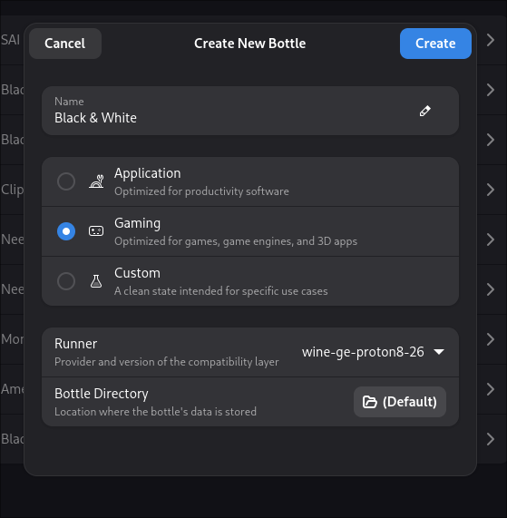
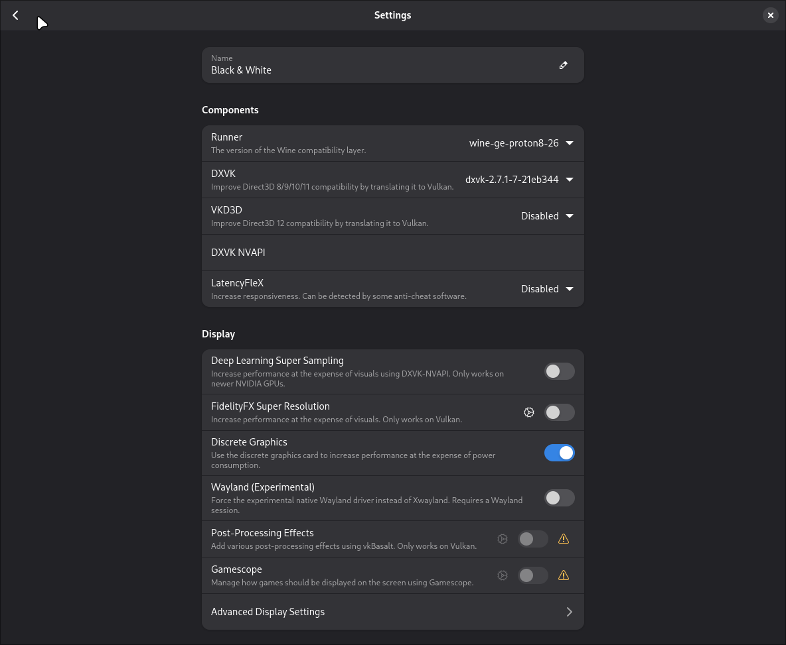
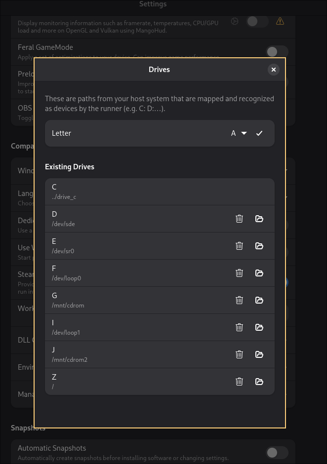
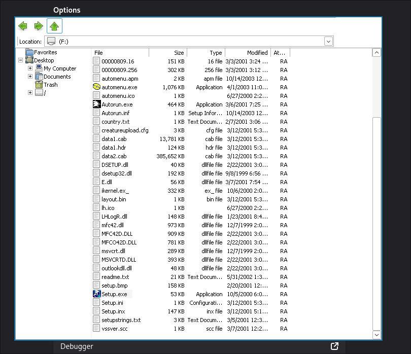
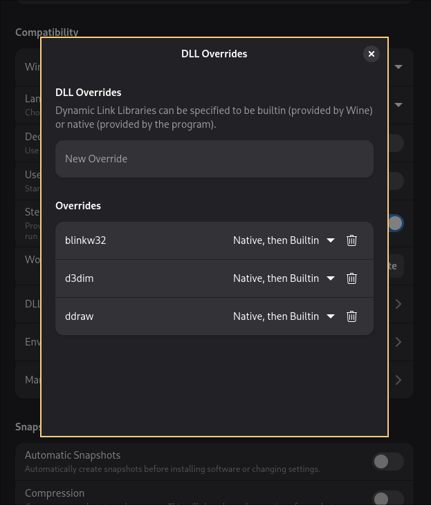
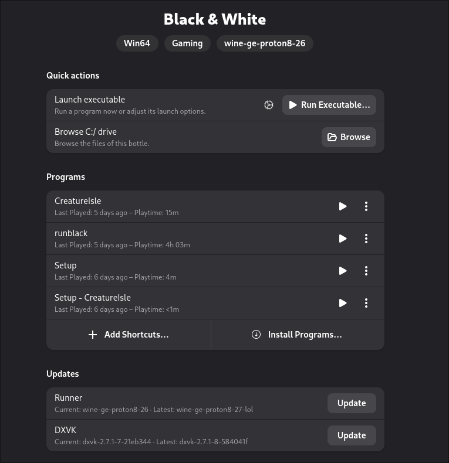
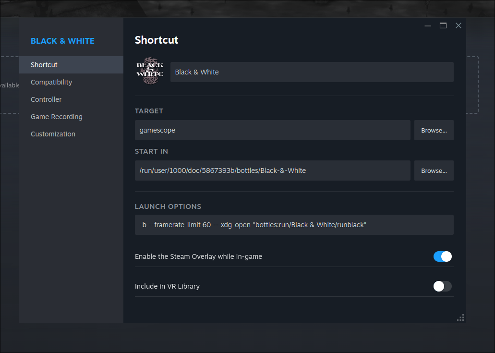
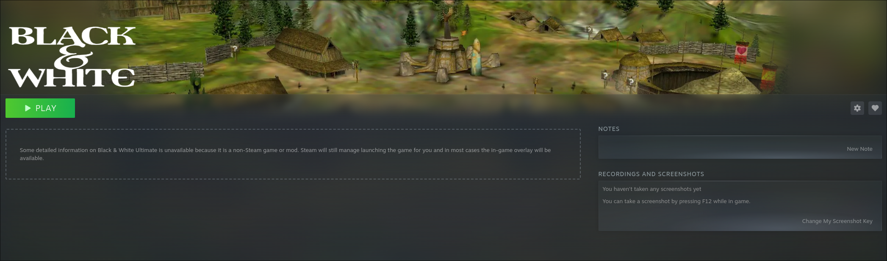
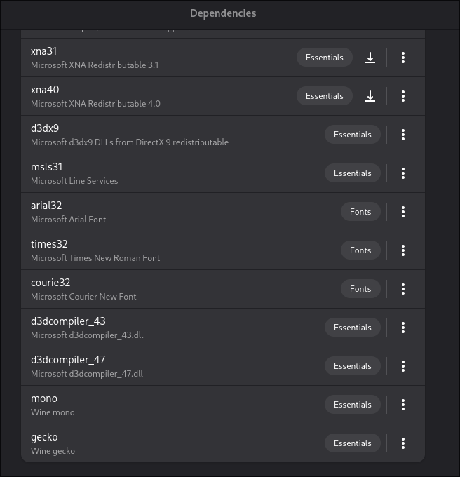

# Black & White on Linux

This guide explains how to install **Black & White (2001)** on Linux using **Wine via Bottles** 🍷.

## Requirements

### System

You need [Bottles](https://usebottles.com/).  
The simplest way to install Bottles is through [Flatpak](https://flathub.org/en/apps/com.usebottles.bottles).

### Game

Black & White is no longer commercially distributed in most regions and is considered **abandonware**.  
Use the original CDs or backups that you own.

- Black & White (2001)
- Black & White: Creature Isle (2002)

#### Patches

- [Villager Banter](https://www.bwgame.net/downloads/villager-banter.139/)
- [Football Addon](https://www.bwgame.net/downloads/football-addon.138/)
- [Patch v1.1](https://forum.bwgame.net/downloads/v1-1-patch.129/)
- [Patch v1.2](https://www.bwgame.net/downloads/v1-2-patch.130/)
- [Patch v1.42 (Fanpatch)](https://www.bwgame.net/downloads/black-white-unofficial-patch-v1-42.1418/)

## Installation (Bottles + Wine)

### Preparation

1. Download all patches and store them in a folder (e.g., `~/Downloads/patches`).
2. Mount the CDs or ISO files:
   - Black & White -> e.g. `/mnt/cdrom`
   - Creature Isle -> e.g. `/mnt/cdrom2`

### Setup Bottle

1. Open **Bottles** and click **"+"** to create a new bottle.

> Bottles Gaming environments already include the required 32-bit compatibility support for older Windows games.

- **Name:** `Black & White`
- **Type:** Gaming
- **Runner:** `wine-ge-proton8-26`

> You can install additional runners in Bottles via  
> **Main Menu -> Preferences -> Runners -> Wine GE**, then download `wine-ge-proton8-26`.

2. Open the bottle **Settings**:

- Disable `VKD3D`
- **Set "Windows Version" to `Windows XP`**

3. Open **Manage Drives** and add your CD-ROM mount points: `/mnt/cdrom` and `/mnt/cdrom2`

> You can also add the folder containing the patches here.  
> CD and patch drives can be removed after installation.

### Install Game

1. Open the **Black & White** bottle.
2. Go to **Tools -> Legacy Wine Tools -> Explorer**.
3. Navigate to the mounted CD and run `Setup.exe`.

> **Note:** A serial key is required. It can usually be found online since the game is **abandonware**.

Use the default settings during installation.  
Skip the ReadMe, do **not** start the game, and skip online registration.

#### Copy Audio Files

Copy the "Audio" directory from the CD into the installed game directory: `C:\Program Files (x86)\Lionhead Studios Ltd\Black & White`.

### Install Patches

Still in Wine Explorer, navigate to your patches folder  
(e.g., `Z:\home\user\Downloads\patches`) and install the patches **in this exact order**:

1. Black_White_Patch_v1.100.exe
2. BW_Football_Addon.exe
3. BW_Villager_Banter.exe
4. black_white_patch_v1_20.exe
5. BWFanPatchInstaller.exe

> Install patches exactly in this order to avoid older installers overwriting newer game files.

### Setup Game

1. In Explorer, go to: `C:\Program Files (x86)\Lionhead Studios Ltd\Black & White`.
2. Run `Setup.exe`
    - Configure resolution and graphics.
    - Optionally enable **Windowed Mode** for testing; you can switch to fullscreen later.

### Install Add-On Creature Isle (Optional)

1. In Explorer, open the Creature Isle CD
2. Run `Setup.exe`
3. Install the Creature Isle fan patch: `BWCIFanPatchInstaller.exe`
4. Do **not** start the game yet

### Final Bottle Configuration

Close Wine Explorer and return to the bottle **Settings**.

#### DLL Overrides

Add the following overrides ("Native, then Builtin"):

- `d3dim`
- `ddraw`
- `d3dim700`

## Start/Test the Game

1. Open **Legacy Wine Tools -> Explorer**
2. Navigate to the game directory
3. Start `runblack.exe`

If the game starts and runs correctly - congratulations 🎉

> With the **Fan Patch**, a no-CD executable is usually **not required**.

### Add Shortcuts

In the **Black & White** bottle, add the following programs:

- CreatureIsle -> `.../bottles/Black-&-White/drive_c/Program Files (x86)/Lionhead Studios Ltd/Black & White/CreatureIsle/CreatureIsle.exe`
- Setup -> `.../bottles/Black-&-White/drive_c/Program Files (x86)/Lionhead Studios Ltd/Black & White/Setup.exe`
- runblack -> `.../bottles/Black-&-White/drive_c/Program Files (x86)/Lionhead Studios Ltd/Black & White/runblack.exe`
- Setup - CreatureIsle -> `.../bottles/Black-&-White/drive_c/Program Files (x86)/Lionhead Studios Ltd/Black & White/CreatureIsle/Setup.exe`

> Tip: Rename shortcuts for clarity.

Try to start the game (`runblack`) via "Programs"...

### Troubleshooting

If the game does not start:

- **Launch via Terminal to see logs:** Click on the "..." next to the `runblack` program and select "Launch with Terminal".
- **Disable VKD3D and DXVK:** Click on the "..." next to the `runblack` program, then click on "Change Launcher Options".
- Turn off **Virtual Desktop**.
- Try different runners:
    - `lutris-ge-...`
    - `kron4ek-wine-proton-...`
- You can always try starting the game via **Wine Explorer**.
- Set the Working Directory to the installed game directory: `.../bottles/Black-&-White/drive_c/Program Files (x86)/Lionhead Studios Ltd/Black & White`
- Use [Flatseal](https://flathub.org/en/apps/com.github.tchx84.Flatseal) to configure permissions for Bottles (such as the filesystem paths for your bottles and games).
- Avoid installing the Game on a NTFS Drive

> Black & White uses old DirectDraw/Direct3D APIs that sometimes work better without DXVK.

#### Add to Steam (Optional)

1. In Bottles, click **"..." -> "Add to Steam"** for `runblack`.
2. Restart Steam if needed.

##### Gamescope (Optional)

In Steam, configure Black & White:
- Go to **Manage -> Properties**.
- Set `gamescope` as target (the **Start In** path may vary).
- Edit Launch Options: `-b -w 1920 -h 1080 --framerate-limit 60 -- gamemoderun flatpak run --command=bottles-cli com.usebottles.bottles run -b "Black & White" -p "runblack"`
    - Set Screen Resolution to 1920x1080 (with Setup.exe)
    - Set Windowed Mode (with Setup.exe)

NOTE: Use the width and height configured in your setup (see Setup.exe).

#### Customize Header

Customize the game logo and header using [SGDBoop](https://www.steamgriddb.com/boop): https://www.steamgriddb.com/game/37411

## Install Mods

- Replace `runblack.exe` with the [Infinite Drawing Distance](https://www.bwgame.net/downloads/black-white-v1-42-infinite-drawing-distance.1464/) mod.
- Install [HD assets](https://www.bwgame.net/downloads/hd-project.1474/).
- Download more custom [Maps](https://www.bwgame.net/downloads/categories/maps.45/).

See [mods/](mods/README.md) for more details.

---

## Additional Information

### Dependencies

_See [Exported bottle config](Black-&-White.yml) for more details._

### Tested Runners

- wine-ge-proton8-26
- GE-Proton9
- kron4ek Wine-Proton

### Limitations

- The game window may only render on the primary monitor if you are playing in windowed mode.
- A fan patch or no-CD executable is required.

#### Lutris

Alternatively, you can use [Lutris](https://lutris.net/games/black-white/) instead of Bottles.

This guide uses Bottles because it offers:

 - Easier Wine prefix management
 - Simpler DLL override configuration
 - Easier Flatpak integration
 - A cleaner Steam workflow
 - Simple switching between Wine runners

Bottles also makes it easier to install directly from original CDs/ISOs and manage game-specific dependencies and Wine runners.

#### Steam

Running Black & White directly as a non-Steam game with Proton often does not work reliably without additional Wine configurations and dependencies.

### My Setup

- CachyOS (64-bit)
- AMD CPU
- NVIDIA GPU
- Hyprland (Wayland)
- Bottles (Flatpak)
- Steam + Gamescope (CachyOS Gaming package)

---

## License

 CC-BY-SA 4.0

---

## Links

- https://www.bwgame.net/downloads/
- https://www.bwgame.net/threads/running-black-white-on-windows-10.7916/
- https://lutris.net/games/black-white/
- https://discord.com/channels/306953102848950273/1237853952066715708
- https://appdb.winehq.org/objectManager.php?amp=&iId=156&sClass=application