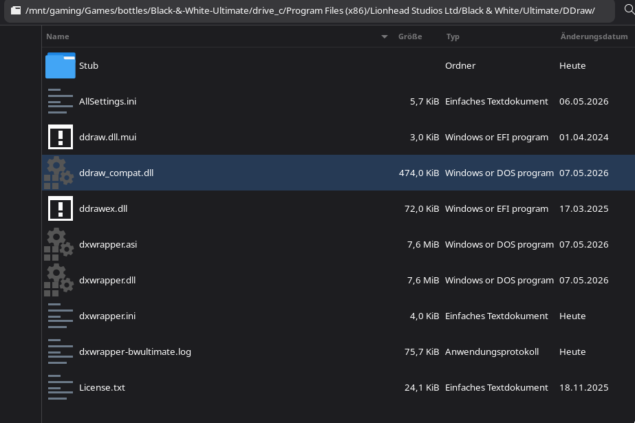

# Mods

## Ultimate

_Black & White: Ultimate is a fan overhaul/modpack for Black & White 1 that includes gameplay tweaks, fixes, and a all-in-one experience._

**Important:** Start from a clean installation of Black & White + Creature Isle.
_Do **not** install unofficial fan patches, or draw-distance with Ultimate, fixes are already included on there own._

_Best case: create a new bottle for Black & White: Ultimate with a fresh B&W installation._

0. Install Black & White + Black & White: Creature Isle(updated to v1.23)
1. Download [Black & White: Ultimate v1.40](https://www.bwgame.net/downloads/black-white-ultimate.1460/)
2. Drag and drop the "Ultimate" folder into your Black & White directory. (`C:\Program Files (x86)\Lionhead Studios Ltd\Black & White`)
3. Add "BWUltimate.exe" as a Bottles Program -> `.../bottles/Black-&-White/drive_c/Program Files (x86)/Lionhead Studios Ltd/Black & White/Ultimate/BWUltimate.exe`
4. Download [dxwrapper](https://github.com/elishacloud/dxwrapper)
5. Extract "dxwrapper" into "Black & White/Ultimate/DDraw"
6. Rename the original `ddraw_compat.dll` to `ddraw_compat.dll.bak` (from the DDraw/ folder)
7. Copy out "ddraw.dll" from `Stub/` folder into "Black & White/Ultimate/DDraw", then rename the new "ddraw.dll" (copied from `Stub/`) -> "ddraw_compat.dll"
8. Setup "DLL Overrides" and "dxwrapper.ini" (see below)

_You can delete the `Stub/` folder now (optional)_



### DLL Overrides

Add these DLL overrides and set them to:

`Native, then Builtin`

- `d3dim`
- `d3dim700`
- `ddraw`

_These overrides force Wine to prefer native DirectX wrapper DLLs over Wine’s builtin implementations._

### Configure dxwrapper.ini

_The `dxwrapper.ini` file is included with dxwrapper._

Configure `dxwrapper.ini` (`Black & White/Ultimate/DDraw/dxwrapper.ini`), change the following Values:

- `D3d9to9Ex=1`
- `Dd7to9=1`
- `DdrawUseDirect3D9Caps=1`


You can setup much more, like running the game in fullscreen but make it borderless:
```ini
[Compatibility]
Dd7to9                     = 1
D3d9to9Ex                  = 1
EnableDdrawWrapper         = 1

[FullScreen]
FullScreen                 = 1
ForceWindowResize          = 1
WaitForWindowChanges       = 0


[d3d9]
EnableVSync                = 1
LimitPerFrameFPS           = 60
FullscreenWindowMode       = 1
```

### Notes

- `gamescope` didn't work for me with `dxwrapper`, but try to setup as much as possible with `dxwrapper` (like VSync and FrameCap)
- try reenabling "DXVK" (in bottles)
- try newer wine runners (`kron4ek-wine-proton-10...`, `ge-proton10`)
- Set "Windows Version" to "Windows 10"
- `dxwrapper` improves DirectDraw compatibility on modern Wine/Proton setups

### Troubleshooting

#### No Menu

- Verify `ddraw_compat.dll` was replaced correctly and wine is using `ddraw` Native

#### Crashes on launch

- Disable DXVK temporarily
- Try another Wine runner

#### Cursor issues

- Try windowed mode
- Uncheck Window Mode in Black & White Setup.exe (fullscreen mode)
    - configure `dxwrapper.ini` for fullscreen usage

#### Special Thanks

Thanks to the people on the Black & White Discord and Shane for creating this mod

## Vanilla 

_With fan patches_

- https://www.bwgame.net/downloads/categories/b-w-mods-apps-tools.46/
- https://www.bwgame.net/downloads/categories/maps.45/

- [HD Project - V1.56 Final.7z](https://www.bwgame.net/downloads/hd-project.1474/)
- [Infinite Drawing Distance - runblack.zip](https://www.bwgame.net/downloads/black-white-v1-42-infinite-drawing-distance.1464/)